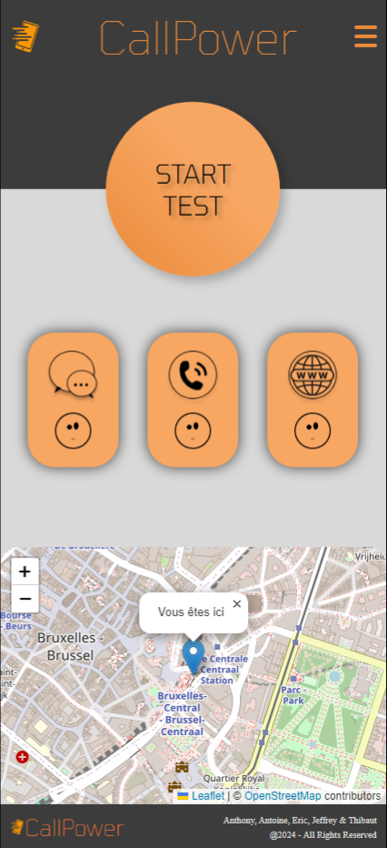

<h1 align="center"> 🟧 Hackathon Orange 🟧 </h1>

### 🌐 Demo / Preview


---

### ✏️ **Description**
This project was our very first **Use Case**, created as a team of four (Anthony, Thibaut, Antoine, and myself) during a hackathon organized by Orange.  

Our mission was to use one or more of Orange's APIs to address either a societal or environmental need. We decided to develop a **speedtest-like application** exclusively for mobile networks. This app measures the quality of:
- SMS sending.
- Call performance.
- Network connectivity.

In the future, we hope to enhance this project by adding a **planning and internal storage system**. This feature would allow hikers to verify mobile network coverage in forests before embarking on long trips, or assist people in risky zones where communication reliability is critical.

### 💻 **Technologies Used**
- **HTML5**: For structuring the application.
- **SCSS**: For styling and ensuring a clean visual appearance.
- **JavaScript**: The core technology used extensively for handling and mastering the APIs.

### **Key Features** 🚀
📊 **Mobile network speedtest**: Focused on SMS, calls, and connectivity.

🔗 **Integration of Orange APIs**: Mastery of complex API calls.

🌲 **Future features planned**: Internal storage and planning system for hikers and people in risky areas.

👥 **Team collaboration**: Successfully worked as a group of four, merging ideas and skills for a societal and environmental purpose.

### 🛠️ **Installation & Usage**
1. Clone the repository:
   
   ```bash
   git clone https://github.com/HUYBERIC/HackathonOrange.git
   cd HackathonOrange
   
   ```

2. Open `index.html` in your favorite browser to use the application.

<br>
<br>
<br>

---

<h1 align="center"> 🟧 Hackathon Orange 🟧 </h1>

---

### ✏️ **Description**
Ce projet représente notre tout premier **Use Case**, réalisé en équipe de quatre (Anthony, Thibaut, Antoine et moi-même) lors d'un hackathon organisé par Orange.  

Notre mission était d'utiliser une ou plusieurs APIs d'Orange pour répondre à un besoin sociétal ou environnemental. Nous avons choisi de développer une **application type speedtest**, exclusivement dédiée au réseau mobile, qui permet de mesurer la qualité :
- De l'envoi de SMS.
- Des appels.
- De la connexion réseau.

Dans le futur, nous aimerions ajouter un **système de planification et de stockage interne**. Cette fonctionnalité permettrait aux randonneurs de vérifier la couverture réseau en forêt avant de s'y aventurer, ou d'aider les personnes en zones à risques.

### 💻 **Technologies utilisées**
- **HTML5** : Pour structurer l'application.
- **SCSS** : Pour le style et l'apparence visuelle.
- **JavaScript** : Technologie principale utilisée massivement pour maîtriser et appeler les APIs.

### **Caractéristiques principales** 🚀
📊 **Speedtest réseau mobile** : Axé sur les SMS, les appels et la connectivité.

🔗 **Intégration des APIs Orange** : Maîtrise des appels API complexes.

🌲 **Fonctionnalités futures** : Système de planification et de stockage interne pour les randonneurs et les zones à risques.

👥 **Collaboration d'équipe** : Travail réussi en équipe de quatre, combinant idées et compétences pour un objectif sociétal et environnemental.

### 🛠️ **Installation & Utilisation**
1. Cloner le dépôt :
   
   ```bash
   git clone https://github.com/HUYBERIC/HackathonOrange.git
   cd HackathonOrange
   
   ```

2. Ouvrir `index.html` dans votre navigateur favori pour utiliser l'application.
